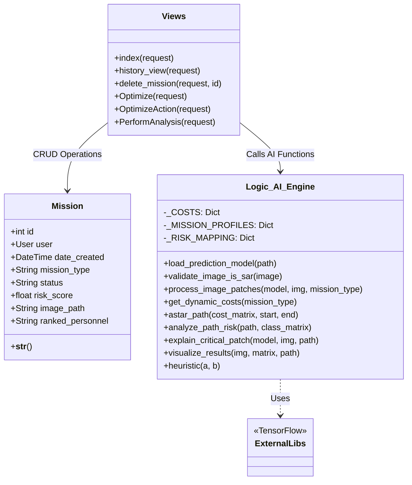
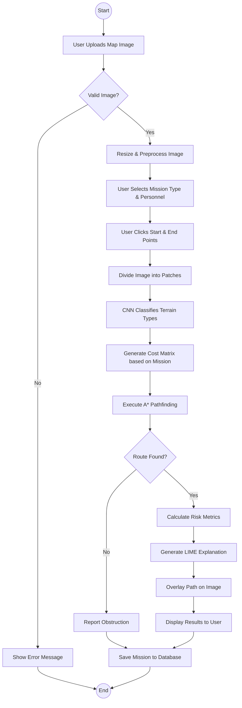
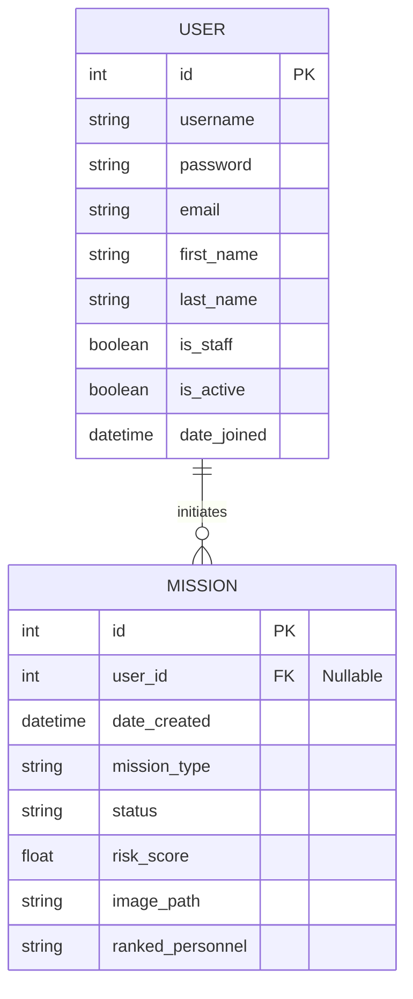

# System Diagrams

## 1. Architecture Diagram
This diagram outlines the high-level structure of the Military Supply Chain Optimization System, separating the Frontend, Backend, AI Engine, and Data Storage.

```mermaid
graph TD
    subgraph Client_Side
        Browser[Web Browser]
        UI[User InterfaceHTML/JS/CSS]
    end

    subgraph Server_Side
        Django[Django Web Server]
        Views[View Controllers]
        Models[Data Models]
    end

    subgraph AI_Engine
        Preprocess[Image Preprocessing (OpenCV)]
        CNN[Terrain Classifier (TensorFlow/Keras)]
        Pathfinding[A* Path Optimization]
        XAI[LIME Explainer]
    end

    subgraph Data_Layer
        DB[(SQLite/PostgreSQL)]
        FileSystem[File Storage (Images/Models)]
    end

    Browser -->|HTTP Request| Django
    Django --> Views
    Views -->|Query/Save| Models
    Models -->|Read/Write| DB
    Views -->|Image Data| Preprocess
    Preprocess --> CNN
    CNN --> Pathfinding
    Pathfinding --> XAI
    Views -->|Save Results| FileSystem
    XAI -->|Explanation Data| Views
    Pathfinding -->|Route Data| Views
    Views -->|Response| Browser
```

## 2. Class Diagram
This diagram details the internal structure of the system, including the Django models for data persistence, the View functions for handling requests, and the Logic module for AI processing.



## 3. Use Case Diagram
This diagram illustrates the interactions between the User (Commander/Logistics Officer) and the system's various functionalities.

```mermaid
usecaseDiagram
    actor Commander as "Mission Commander"

    package "Military Supply Chain System" {
        usecase "Upload Satellite Map" as UC1
        usecase "Validate Image" as UC2
        usecase "Select Mission Profile" as UC3
        usecase "Define Start/End Points" as UC4
        usecase "View Optimized Route" as UC5
        usecase "View Risk Analysis" as UC6
        usecase "View AI Explanation" as UC7
        usecase "Manage Mission History" as UC8
    }

    Commander --> UC1
    UC1 ..> UC2 : <<include>>
    Commander --> UC3
    Commander --> UC4
    Commander --> UC5
    UC5 ..> UC6 : <<include>>
    UC5 ..> UC7 : <<extend>>
    Commander --> UC8
```

## 4. Activity Diagram
This diagram visualizes the flow of control from the moment a user uploads an image to the generation of the final optimized route.



## 5. Entity-Relationship (ER) Diagram
This diagram represents the database schema and the relationships between the data entities in the system.


